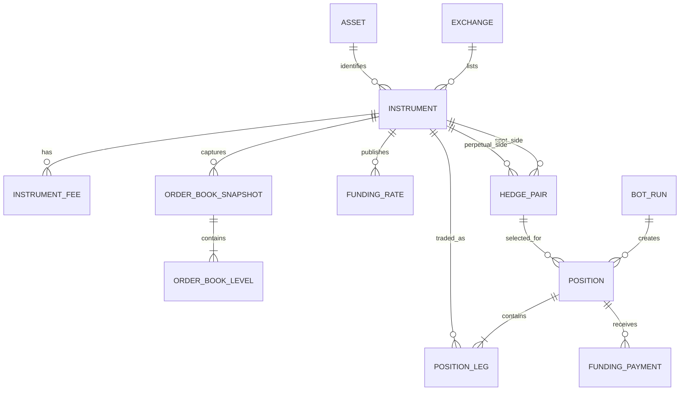

# Funding-Arbitrage Database Models

## Overview

The database is split into two Django apps:

- `markets` holds exchange reference data, instrument fees, order books, and funding rates.
- `trading` holds bot runs and the positions created from market opportunities.

A `HedgePair` connects a spot instrument to the corresponding perpetual instrument. A
`BotRun` evaluates the pair's order books, funding rates, and effective fee schedules. When
the strategy enters a trade, it creates a `Position` with a long spot `PositionLeg` and a
short perpetual `PositionLeg`. Every funding settlement earned or paid while the position
is open is copied into a `FundingPayment`.

## Entity Relationship Diagram



## `markets` Models

### `Exchange`

Represents a supported venue. Its name is unique, its status is `ACTIVE` or `INACTIVE`,
and `metadata_json` holds exchange-specific information that does not need a normalized
column.

### `Asset`

Normalizes an asset such as BTC or USDT across exchanges. `symbol` is globally unique so
different venue symbols can refer to the same asset.

### `Instrument`

Represents one tradeable market on one exchange. Spot and perpetual markets are separate
records. It stores base, quote, and settlement assets; exchange symbol; instrument type;
status; contract multiplier; tick and quantity sizes; minimum order limits; and the funding
interval when applicable.

- Types: `SPOT`, `PERPETUAL`
- Statuses: `ACTIVE`, `SUSPENDED`, `DELISTED`
- Unique key: `(exchange, exchange_symbol)`

### `HedgePair`

Connects the exact spot and perpetual instruments that the strategy may trade together.
The pair is unique and can be enabled or disabled.

Django validation requires the spot reference to be `SPOT`, the perpetual reference to be
`PERPETUAL`, and both instruments to share a base asset and exchange.

### `InstrumentFee`

Stores the maker and taker rates that apply to an instrument and account tier during a
half-open period: `[effective_from, effective_to)`. A null `effective_to` means the fee
remains effective indefinitely.

PostgreSQL's `btree_gist` extension and an exclusion constraint prevent periods from
overlapping for the same instrument and account tier. Historical fee rows remain available
so a strategy can reproduce the costs known at a given time.

### `OrderBookSnapshot`

Records an instrument's order book at one time, including the venue sequence/checksum when
available and the maximum retained level count for each side. For example,
`depth_per_side=20` allows 20 bid rows and 20 ask rows.

The snapshot is unique by `(instrument, captured_at)`. That unique constraint also supplies
the index for chronological snapshot lookup.

### `OrderBookLevel`

Stores one `BID` or `ASK` level for a snapshot. `level_index=1` is the best price. Price,
quantity, and index must be positive, and Django validation prevents an index from exceeding
the snapshot's per-side depth.

The unique `(snapshot, side, level_index)` constraint permits one level at each position and
provides the ordered reconstruction index.

Relational storage is deliberate but expensive: at depth 20 and one snapshot each second,
one instrument can produce 3,456,000 level rows per day. Ingestion cadence, depth, retention,
and archival must be bounded before collecting long histories.

### `FundingRate`

Stores a funding rate for a perpetual instrument. `observed_at` records when the bot could
know the value, while `settlement_at` records when the payment applies. This separation
prevents backtests from using future information.

Rates are unique by `(instrument, observed_at, settlement_at)`. Django validation accepts
only perpetual instruments and rejects observations later than settlement.

## `trading` Models

### `BotRun`

Represents one backtest or paper-trading session. It records its account tier, capital,
funding thresholds, position limit, accepted order-book age, and lifecycle times.

- Modes: `BACKTEST`, `PAPER`
- Statuses: `CREATED`, `RUNNING`, `COMPLETED`, `FAILED`, `CANCELLED`

### `Position`

Groups one complete funding-arbitrage trade under a bot run and hedge pair. It records the
target notional and lifecycle timestamps.

- Statuses: `PENDING`, `OPEN`, `CLOSED`, `FAILED`
- `OPEN` and `CLOSED` positions must have exactly one long spot leg and one short perpetual
  leg from their hedge pair.
- `net_pnl` is derived rather than stored:

  `leg gross realized P&L - entry fees - exit fees + funding payments`

### `PositionLeg`

Represents one executed side of a position. It stores quantity, entry/exit prices, copied
fee rates, fee amounts, and gross realized P&L. Copying the rates keeps past results stable
after an `InstrumentFee` changes.

V1 permits only `BUY` for the hedge pair's spot instrument and `SELL` for its perpetual
instrument. `(position, instrument)` is unique.

### `FundingPayment`

Records one funding settlement associated with a position. `funding_rate` and
`eligible_notional` are point-in-time copies, intentionally duplicating market data so the
position result remains reproducible. A positive amount is received and a negative amount
is paid.

## Precision and Audit Fields

Every model has `created_at` and `updated_at`. All application timestamps are timezone-aware
and Django is configured for UTC.

| Value | `max_digits` | `decimal_places` |
| --- | ---: | ---: |
| Prices and price ticks | 30 | 12 |
| Quantities and contract multipliers | 38 | 18 |
| Funding and fee rates | 24 | 18 |
| Capital, notionals, fees, payments, and P&L | 38 | 18 |

## Constraint Ownership

PostgreSQL enforces local row checks, enum values, positive numeric values, unique keys,
foreign keys, and non-overlapping fee periods. It also provides these hot-path indexes:

- `FundingRate(instrument, settlement_at)`
- `FundingRate(instrument, observed_at)`
- `InstrumentFee(instrument, account_tier, effective_from)`
- `Position(bot_run, status)`

Django `clean()` enforces rules that require related rows: hedge-pair compatibility,
perpetual-only funding, per-side snapshot depth, position leg membership and direction, and
the completed two-leg position shape. Normal model saves call `full_clean()`. `bulk_create()`,
`bulk_update()`, and direct queryset updates bypass those methods, so callers must validate
equivalent invariants before using bulk operations.

## PostgreSQL Setup

The settings module reads these variables, with local defaults shown:

```text
POSTGRES_DB=furate
POSTGRES_USER=furate
POSTGRES_PASSWORD=furate
POSTGRES_HOST=127.0.0.1
POSTGRES_PORT=5432
```

Install dependencies and apply the schema after creating the PostgreSQL database and user:

```shell
python -m pip install -r requirements.txt
python manage.py migrate
```

The migration order is `markets.0001_enable_btree_gist`, `markets.0002_initial`, then
`trading.0001_initial`. The PostgreSQL user applying the first migration must be allowed to
create the `btree_gist` extension, or an administrator must enable it beforehand.
